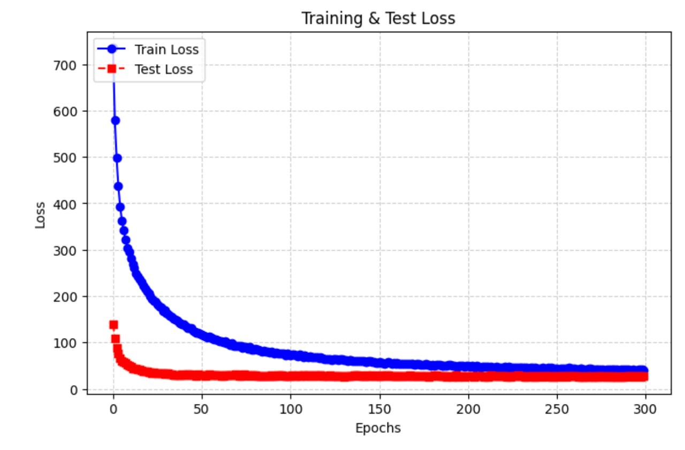
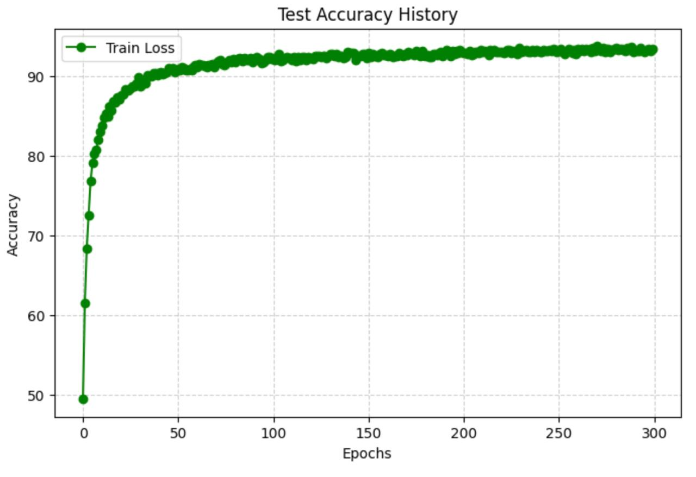

# Deep Learning Project: Efficient CIFAR-10 Classification

This repository contains code for training a convolutional neural network (CNN) on the CIFAR-10 dataset using advanced data augmentation techniques, mixed precision training, and a OneCycleLR scheduler. The model architecture is inspired by EfficientNet-style blocks and includes custom residual and squeeze-and-excitation layers.

## Repository Structure

- README.md  
- dl-project-final-report.tex  
- train.py  
- predict.py  
- model.py  
- data_loader.py  
- best_model_retrain.pth  
- submission.csv  
- (Optional) Loss plot images (e.g., `train_loss.png`, `test_loss.png`)

## Requirements

- Python 3.7+
- PyTorch 1.7+
- TorchVision
- Ignite
- NumPy
- Pandas
- Matplotlib
- tqdm
- (Optional) torchsummary for model summary

*Please install the necessary packages using your preferred method (e.g., pip or conda).*

## Installation

1. **Clone the repository:**

    ```bash
   git clone https://github.com/therealnaveenkamal/EfficientCIFARNet.git
    cd EfficientCIFARNet
    ```

2. **Install dependencies manually** (e.g., via pip):

    ```bash
    pip install torch torchvision ignite numpy pandas matplotlib tqdm
    ```

## Usage

### Training

The repository includes a training script that loads and preprocesses CIFAR-10 data using a custom `CIFAR` class, builds the EfficientNet-style model, and trains it for a specified number of epochs using OneCycleLR scheduling with mixed precision. The best performing model weights are saved to `best_model_retrain.pth`.

### Prediction

After training, the prediction script loads test data from a pickle file, preprocesses it with the `UnseenDataset` class, and uses the trained model to predict labels for the test set. The predictions are then saved to a CSV file named `submission.csv`.

## Model Architecture

The model is based on an EfficientNet-style architecture with the following components:

- **Stem:** Initial convolution and squeeze-excitation block.
- **Block Stack:** A series of MBConv blocks with residual connections and depthwise convolutions.
- **Head:** A fully connected layer with dropout, followed by a softmax output.

A TikZ diagram of the architecture is provided in the LaTeX report (`dl-project-final-report.tex`).

## Evaluation

During training, both training and validation loss/accuracy are monitored. Key metrics include:
- **Training Accuracy:** ~98%
- **Validation Accuracy:** ~93%
- **Test Accuracy:** ~92.7%

A parameter limit of 5,000,000 trainable parameters is enforced to ensure the model remains efficient.

## Loss Plots

Below are sample images of the training and test loss curves:

  


## Code Overview

- **Model Initialization:**  
  The model is instantiated, initialized with Kaiming Normal, and loaded with pretrained weights if available.

- **Training Loop:**  
  The training loop uses PyTorch Ignite for supervised training, mixed precision for efficiency, and a OneCycleLR scheduler for learning rate adjustment.

- **Prediction Pipeline:**  
  The prediction script loads test data, preprocesses it, runs inference with the trained model, and writes the output to a CSV file (`submission.csv`).

## Contributing

Contributions to enhance the model, improve data preprocessing, or refine training techniques are welcome. Please open an issue or submit a pull request.

## License

This project is licensed under the MIT License. See the [LICENSE](LICENSE) file for details.

## Contact

For any questions or suggestions, please contact:
- **Sheetal Prasad** (sp7990@nyu.edu)
- **Naveenraj Kamalakannan** (nk3940@nyu.edu)
- **Harish Balaji** (hb2917@nyu.edu)
